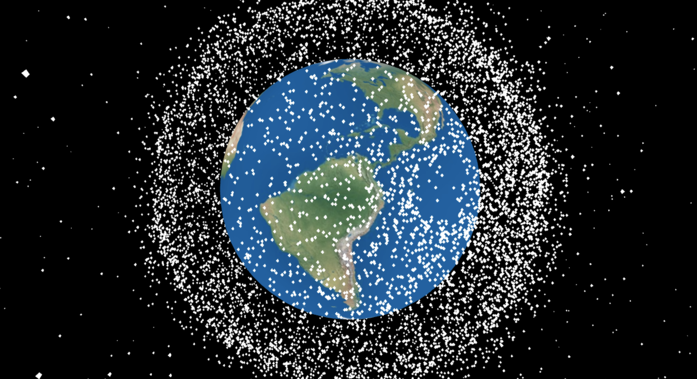
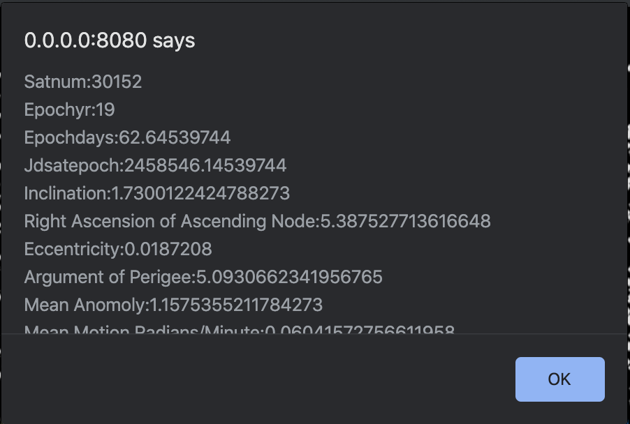

# Space-Junk-Visualization
This is a visualization of space debris and other satellites using three.js and satellite.js.

## Requirements
All requirements are detailed in boot.sh but are fairly standard linux requirements.

### Python Libraries
1. pip install flask
2. pip install sgp4
3. pip install requests
4. pip install python-dateutils

For the actual running of the server you likely do not need the reqeusts library.  It was used in testing get/post commands in test.

### NPM
A few libraries will need to be installed with NPM.
1. npm install three
2. npm install satellite.js
3. npm install -g browserify

There is already a version in the repo titled index.js that should be able to worked with.  You can make changes to that directly
and not use browserify or make changes to template.js and use browserify.  All we are using browserify for is to include
the corresponding libraries inside index.js that are used in template.js.

### Curl
If you are using the tool to fetch updated satellite data then you are going to want to have curl installed and update the satellite_data_fetch.py with your credentials to the website.

### Boot.sh
There is a boot script that can be used that does the browserify conversions for you and then boots the application.
Note that browserify needs to be installed globally.

### Pictures

Here is an example of what the application looks like.

Here is an example of the data window when you click on a piece of debris.
